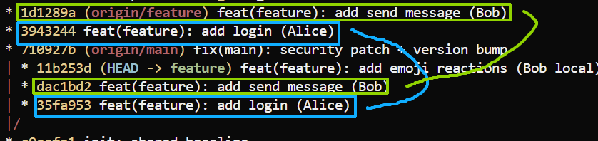

# 03 — 场景A：错误解冲突（历史永久污染）

对应脚本：[`scripts/02-wrong-merge-resolve.py`](../scripts/02-wrong-merge-resolve.py)

作用：用日常习惯「改文件 → add → commit」完成 merge，看清：工作区可以「看起来正确」，但历史上会出现双胞胎提交。

前置：已完成 [02-场景A-实验步骤.md](./02-场景A-实验步骤.md)，且 **Bob 仍在冲突中**。

在仓库**根目录**操作。

---

## 方式一：一键

```bash
# 初始化工作目录
python scripts/00-reset-workspace.py

# 复现场景A origin被alice force rabase，然后bob本地有更新德时候pull代码
python scripts/01-scenario-A-duplicate-history.py

# bob无视双胞胎commit，直接3-way 合并
python scripts/02-wrong-merge-resolve.py

# 复现双胞胎提交
cd ./workspaces/bob
git lg
```

1. Bob commit链是 init-login-send-emoji（未提交）=ilse

2. Alice main开发mix，将login和send rebase 强推origin

3. Origin commit变为 init-mix-login-send = imls

4. login send 两个commit 的历史变了（父节改变）
   

5. Bob没有留意，直接按老办法，按3-way合并，变更全都要
* **3-way-merge，readme目录全覆盖，app.py函数覆盖，之后提交**
  

---

## 方式二：手搓（与脚本等价）

### 1. 确认仍在冲突中

```bash
cd workspaces/bob
git status
# 应看到 both modified / UU（Unmerged）
```

若没有冲突：请重做 [02-场景A](./02-场景A-实验步骤.md)，在 pull 冲突后立刻进入本实验。

---

### 2. 按「全都要」覆盖冲突文件

**文件** `workspaces/bob/README.md`：

```markdown
# Team Chat

- security patch on main
- login
- messages
- emoji reactions (Bob WIP)
```

**文件** `workspaces/bob/app.py`：

```python
VERSION = '0.2'

def greet(name):
    return f'Hello, {name}!'

def login(user, password):
    return user == 'admin' and password == 'secret'

def send_message(user, text):
    return f'{user}: {text}'

def add_reaction(msg, emoji):
    return f'{msg} {emoji}'
```

---

### 3. 完成 merge commit

```bash
git add README.md app.py
git commit -m "merge: resolve after public rebase (WRONG - pollutes history)"
```

---

## 完成后应有 / 验证

| 观察点                       | 预期                        |
| ------------------------- | ------------------------- |
| 工作区                       | 无冲突，功能齐全                  |
| `git log --graph`         | 有 WRONG merge，两侧旧/新链都在    |
| grep login / send_message | **各两条**（同 message、不同 SHA） |

自检：

```bash
cd workspaces/bob
git log --oneline --graph --all --decorate -20

git log --oneline --all --grep="add login"
git log --oneline --all --grep="send_message"
```

---

## 注意

跑完本实验后历史已脏，但可用 [04-正确恢复](./04-场景A-正确恢复.md)：`reset --hard HEAD~1` 撤掉 WRONG merge，再自己找 oldTip 做 `rebase --onto`。
