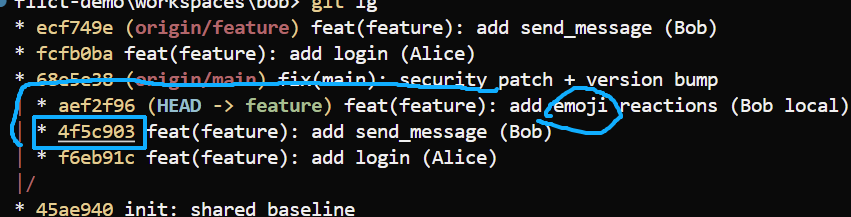
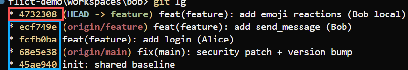

# 04 — 场景A：正确恢复（`reset` + 找 oldTip + `rebase --onto`）

对应脚本：[`scripts/03-proper-recovery-onto.py`](../scripts/03-proper-recovery-onto.py)

作用：错误 merge **已经提交**（[03](./03-场景A-错误解冲突.md) 跑完）。

#### 情况说明：

1. 一开始，alice 和 bob 的init链为 `init-login-send_msg`
2. alice在main上开发了mix，然后为了本地历史干净，将login 和 send rebase到main上，变为了 `init-mix-login-msg`
3. **关键错误** alice将这条rebase后的commits强制推了上去，直接导致Bob这边的login 和 send两处commit的哈希变化，代码相同，但是哈希不同（父节点变基）
4. Bob在自己的分支上开发了emoji提交，然后拉，由于commit msg写不秦楚，内容没细看，本质是双胞胎commit，只能3way-merge，bob选择遍历所有工作内容，全量覆盖文件。出现3-way-merge

前置：刚做完 [03-错误解冲突](./03-场景A-错误解冲突.md)，Bob 的 `feature` 上已有 WRONG merge。

```bash
# 场景A
python scripts/00-reset-workspace.py
python scripts/01-scenario-A-duplicate-history.py
python scripts/02-wrong-merge-resolve.py

cd workspaces/bob
git lg

```

#### 解决方案（以alice提交为准）

1. Bob **`reset` 撤掉** 3way-merge
2. Bob拉取origin，找到变基前的commits，也就是从send-msg之后，自己的开发部分，挪到origin的commits上。
3. rebase是基于内容来进行合并，而不是历史哈希或者父节点，这样就能消化掉旧的login 和 sen-msg。
4. 等于推上去之后，alice发现是ff-merge。而不是3-way的双胞胎冲突

#### 图解理解

`git rebase --onto <新基点> <from> <to>`  
**注意，变基是取尾不取头，from是不包含的，所以要找到from~，接就是截取部分的父节点才可以**

``` text

A - B - C - D - E  (feature 分支)
    |
    F - G - H  (master 分支)

git rebase --onto H B E
把b到e，包含e不包含b的提交，挪到H上

A - B - F - G - H  (master 分支)
                |
                C' - D' - E'  (feature 分支)
```

## 解决步骤

### 1. 撤掉错误 merge

```bash
cd workspaces/bob
# 删除提交，回到3-way-merge的状态
git reset --hard HEAD~1
# 撤掉 merge commit，回到 merge 前（emoji 仍在）

git lg
```

---

### 2. 通过历史记录，找到alice的rebase历史点

** 查看历史

```bash
git fetch origin
git lg
```

在本地旧链上找到emoji：



现在，`git rebase --onto origin/feature 4f5c903 HEAD`
通过rebase消化掉之前的双胞胎提交（rebase只看内容不看节点，不存在内容相同，哈希不同，视为不同的情况）

### 若重放 emoji 时冲突：解完再 continue

**文件** `workspaces/bob/README.md`：

```markdown
# Team Chat

- security patch on main
- login
- messages
- emoji reactions (Bob WIP)
```

**文件** `workspaces/bob/app.py`：

```python
VERSION = '0.2'

def greet(name):
    return f'Hello, {name}!'

def login(user, password):
    return user == 'admin' and password == 'secret'

def send_message(user, text):
    return f'{user}: {text}'

def add_reaction(msg, emoji):
    return f'{msg} {emoji}'
```

```bash
git add README.md app.py
git rebase --continue
# 现在，等于接纳了alice 的rabse结果，头部新增功能
# alice ff-merge即可
```



---

## 完成后应有 / 验证

| 观察点 | 预期 |
| --- | --- |
| `git lg` | 接到新 `origin/feature` 上，只有一份 login / send_message |
| `grep add login` | **一条** |
| `grep send_message` | **一条** |
| HEAD | emoji（新 SHA）在新底座之上 |

自检：

```bash
cd workspaces/bob
git lg
git log --oneline --grep="add login"
git log --oneline --grep="send_message"
```

emoji 从未推送过则可：

```bash
git push origin feature
```

---

## 流程小结

```text
WRONG merge 已提交
  → reset --hard HEAD~1
  → 自己找 oldTip
  → rebase --onto origin/feature <oldTip> feature
```

若 WRONG merge **已 push 到远程**：本地同样清理后，需 `push --force-with-lease` 并告知同事。

下一步 → [05-场景B-实验步骤.md](./05-场景B-实验步骤.md)
